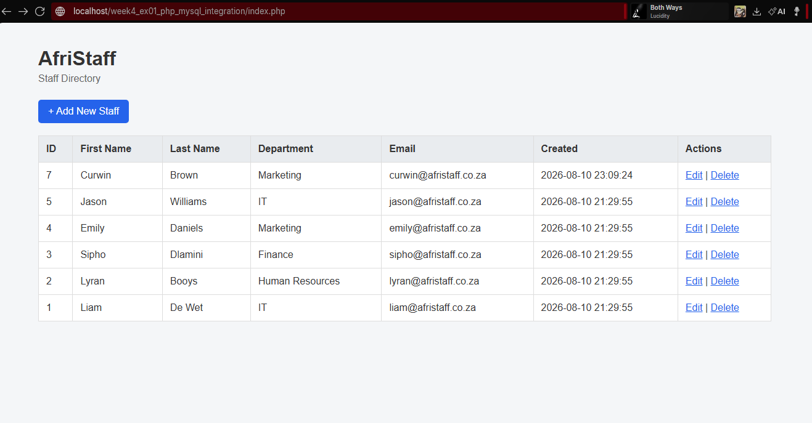

# AfriStaff

## Description

AfriStaff is a simple PHP and MySQL staff management system designed for a growing company. It allows staff records to be created, viewed, updated, and deleted through a web browser.

## Tech Stack

- **PHP** – Used to build the backend logic and handle CRUD operations.
- **MySQL** – Used to store and manage staff records.
- **XAMPP** – Provides the local Apache web server and MySQL environment.
- **phpMyAdmin** – Used to manage the MySQL database through a web interface.
- **HTML** – Used to structure the application's web pages and forms.
- **CSS** – Used to provide consistent styling and improve the readability of the application.

## Prerequisites

Before running the project, make sure you have:

- XAMPP installed.
- Apache enabled in the XAMPP Control Panel.
- MySQL enabled in the XAMPP Control Panel.
- MySQL configured to run on port `3307`.
- A web browser.

## Database Setup

Open phpMyAdmin by visiting:

http://localhost/phpmyadmin/

Create a database named:

```sql
CREATE DATABASE IF NOT EXISTS afristaff_db;

CREATE TABLE IF NOT EXISTS staff (
    id INT AUTO_INCREMENT PRIMARY KEY,
    first_name VARCHAR(100) NOT NULL,
    last_name VARCHAR(100) NOT NULL,
    department VARCHAR(100) NOT NULL,
    email VARCHAR(150) NOT NULL,
    created_at TIMESTAMP DEFAULT CURRENT_TIMESTAMP
);


INSERT INTO staff (first_name, last_name, department, email)
VALUES
('Liam', 'De Wet', 'IT', 'liam@afristaff.co.za'),
('Lyran', 'Booys', 'Human Resources', 'lyran@afristaff.co.za'),
('Sipho', 'Dlamini', 'Finance', 'sipho@afristaff.co.za'),
('Emily', 'Daniels', 'Marketing', 'emily@afristaff.co.za'),
('Jason', 'Williams', 'IT', 'jason@afristaff.co.za');
```

## Installation

### Clone the repo

```
git clone https://github.com/LiamDeWet/LCA-PHP-MySQL-Integration.git
```

Copy the project folder into the XAMPP ` htdocs` directory

## How to run

1. Open the XAMPP Conrol Panel
2. Start Apache.
3. Start MySQL.
4. Confirm MySQL is running on port 3307.
5. Open a web browser.
6. Navigate to:

```
http://localhost/week4_ex01_php_mysql_integration/index.php
```

## Screenshot:

